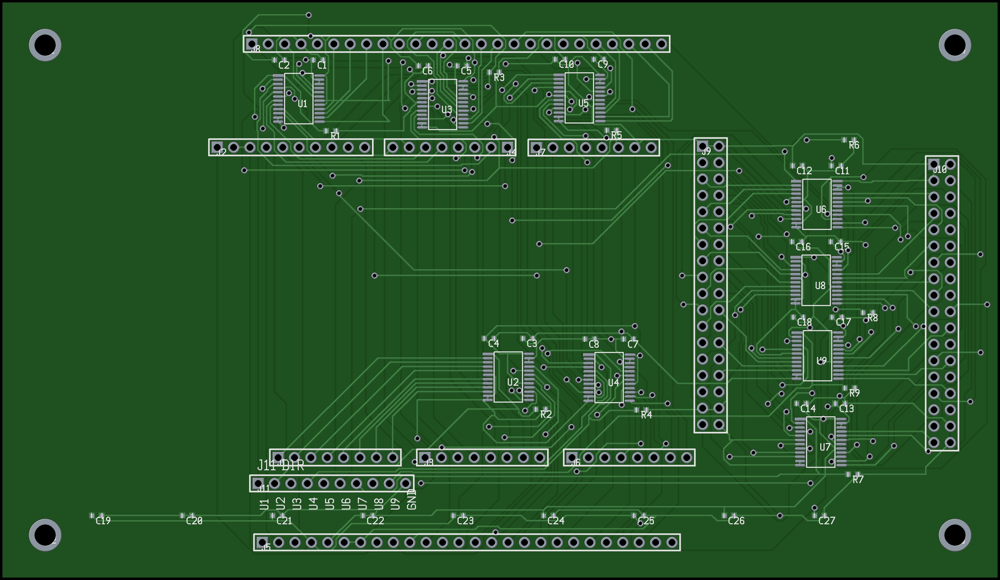
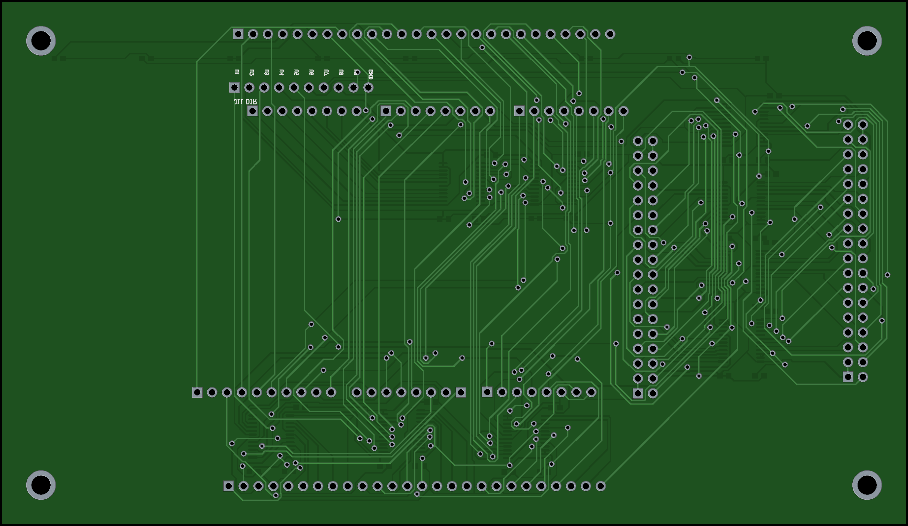

# Arduino Giga R1 WiFi Shield - Driven Level Shifter Redesign

## Overview

This is a redesigned shield/daughter board for the **Arduino Giga R1 WiFi** that replaces the original TXB0108PW auto-sensing bidirectional level translators with **SN74LVC8T245PW** driven (direction-controlled) level shifters.

The board provides 72 channels of 3.3V-to-5V level shifting across 9 ICs, mapping the Giga's 3.3V GPIO signals to 5V-compatible headers suitable for interfacing with retro hardware such as the Z80 CPU via a RetroShield.

## Why the Redesign

The original board used **TXB0108PW** auto-sensing bidirectional level translators. While convenient (no direction pin needed), the auto-sensing mechanism fails during Z80 bus cycles when signals are tri-stated. During these periods, the TXB0108 cannot determine the correct drive direction, causing the Arduino to be completely blind to certain Z80 execution states. This makes reliable bus monitoring and intervention impossible.

The **SN74LVC8T245PW** is a driven (explicit direction control) 8-bit dual-supply bus transceiver. The DIR pin explicitly sets the translation direction:
- **DIR LOW** = A-port to B-port (3.3V to 5V)
- **DIR HIGH** = B-port to A-port (5V to 3.3V)

This eliminates the ambiguity during tri-state periods and gives the Arduino full control over when it's reading vs. writing the bus.

## Board Specifications

| Parameter | Value |
|-----------|-------|
| Dimensions | 155mm x 90mm |
| Layers | 2 (top + bottom copper) |
| Level Shifters | 9x SN74LVC8T245PW (TSSOP-24) |
| Decoupling Caps | 27x 0.1uF ceramic (0603) |
| DIR Pull-downs | 9x 10K resistor (0603) |
| Connectors | 10x pin headers (J1-J10) + 1x DIR control (J11) |
| Mounting Holes | 4x 3.2mm |
| Traces | 1843 |
| Vias | 158 |

## Signal Mapping

Each SN74LVC8T245PW translates 8 signals between the Giga's 3.3V domain (A-port) and the 5V headers (B-port).

### U1 - SCL/SDA/D9-D13
| A-Port (3.3V) | B-Port (5V) | Function |
|----------------|-------------|----------|
| SCL1 | PB6 | I2C Clock |
| SDA1 | PH12 | I2C Data |
| AREF_3V3 | AREF | Analog Reference |
| D13 | PH6 | Digital 13 |
| D12 | PJ11 | Digital 12 |
| D11 | PJ10 | Digital 11 |
| D10 | PK1 | Digital 10 |
| D9 | PB9 | Digital 9 |

### U2 - Analog A0-A7
| A-Port (3.3V) | B-Port (5V) | Function |
|----------------|-------------|----------|
| PC4 | A0 | Analog 0 |
| PC5 | A1 | Analog 1 |
| PB0 | A2 | Analog 2 |
| PB1 | A3 | Analog 3 |
| PC3 | A4 | Analog 4 |
| PC2 | A5 | Analog 5 |
| PC0 | A6 | Analog 6 |
| PA0 | A7 | Analog 7 |

### U3 - Digital D1-D8
| A-Port (3.3V) | B-Port (5V) | Function |
|----------------|-------------|----------|
| D8 | PB8 | Digital 8 |
| D7 | PB4 | Digital 7 |
| D6 | PD13_5V | Digital 6 |
| D5 | PA7 | Digital 5 |
| D4 | PJ8 | Digital 4 |
| D3 | PA2 | Digital 3 |
| D2 | PA3 | Digital 2 |
| D1 | PA9 | Digital 1 |

### U4 - Analog A8-A11, DAC, CAN
| A-Port (3.3V) | B-Port (5V) | Function |
|----------------|-------------|----------|
| PC2_C | A8 | Analog 8 |
| PC3_C | A9 | Analog 9 |
| PA1_C | A10 | Analog 10 |
| PA0_C | A11 | Analog 11 |
| PA4 | DAC0 | DAC Channel 0 |
| PA5 | DAC1 | DAC Channel 1 |
| PB5 | CAN_RX | CAN Bus RX |
| PB13 | CAN_TX | CAN Bus TX |

### U5 - Digital D0, D14-D20
| A-Port (3.3V) | B-Port (5V) | Function |
|----------------|-------------|----------|
| D0 | PB7 | Digital 0 |
| D14 | PG14 | Digital 14 |
| D15 | PC7 | Digital 15 |
| D16 | PH13 | Digital 16 |
| D17 | PI9 | Digital 17 |
| D18 | PD5 | Digital 18 |
| D19 | PD6 | Digital 19 |
| D20 | PB11 | Digital 20 |

### U6 - Digital Even D22-D36
| A-Port (3.3V) | B-Port (5V) | Function |
|----------------|-------------|----------|
| D22 | PJ12 | Digital 22 |
| D24 | PG12 | Digital 24 |
| D26 | PJ14 | Digital 26 |
| D28 | PJ15 | Digital 28 |
| D30 | PK3 | Digital 30 |
| D32 | PK4 | Digital 32 |
| D34 | PK5 | Digital 34 |
| D36 | PK6 | Digital 36 |

### U7 - Digital Odd D37-D51
| A-Port (3.3V) | B-Port (5V) | Function |
|----------------|-------------|----------|
| D37 | PJ6 | Digital 37 |
| D39 | PI14 | Digital 39 |
| D41 | PK7 | Digital 41 |
| D43 | PI10 | Digital 43 |
| D45 | PI13 | Digital 45 |
| D47 | PB2 | Digital 47 |
| D49 | PE4 | Digital 49 |
| D51 | PE5 | Digital 51 |

### U8 - Digital Odd D21-D35
| A-Port (3.3V) | B-Port (5V) | Function |
|----------------|-------------|----------|
| D21 | PH4 | Digital 21 |
| D23 | PG13 | Digital 23 |
| D25 | PJ0 | Digital 25 |
| D27 | PJ1 | Digital 27 |
| D29 | PJ2 | Digital 29 |
| D31 | PJ3 | Digital 31 |
| D33 | PJ4 | Digital 33 |
| D35 | PJ5 | Digital 35 |

### U9 - Digital Even D38-D52
| A-Port (3.3V) | B-Port (5V) | Function |
|----------------|-------------|----------|
| D38 | PJ7 | Digital 38 |
| D40 | PE6 | Digital 40 |
| D42 | PI15 | Digital 42 |
| D44 | PG10 | Digital 44 |
| D46 | PH15 | Digital 46 |
| D48 | PK0 | Digital 48 |
| D50 | PI11 | Digital 50 |
| D52 | PK2 | Digital 52 |

## DIR Control (J11)

The J11 header provides per-shifter direction control. Each pin corresponds to one SN74LVC8T245PW's DIR input. A **10K pull-down resistor** on each DIR line defaults the direction to **A-to-B (3.3V to 5V)**.

| J11 Pin | Signal | Controls |
|---------|--------|----------|
| 1 | DIR_U1 | U1 (SCL/SDA/D9-D13) |
| 2 | DIR_U2 | U2 (A0-A7) |
| 3 | DIR_U3 | U3 (D1-D8) |
| 4 | DIR_U4 | U4 (A8-A11/DAC/CAN) |
| 5 | DIR_U5 | U5 (D0/D14-D20) |
| 6 | DIR_U6 | U6 (Even D22-D36) |
| 7 | DIR_U7 | U7 (Odd D37-D51) |
| 8 | DIR_U8 | U8 (Odd D21-D35) |
| 9 | DIR_U9 | U9 (Even D38-D52) |
| 10 | GND | Ground reference |

To change a shifter's direction to **B-to-A (5V to 3.3V)**, drive the corresponding J11 pin HIGH (3.3V). This is done by running jumper wires from available Giga GPIO pins to the J11 header. Software then controls direction by toggling those GPIOs.

## Connectors

| Ref | Type | Pins | Location | Function |
|-----|------|------|----------|----------|
| J1 | 1x8 | 8 | Bottom edge | Giga 3.3V analog header |
| J2 | 1x10 | 10 | Top edge | Giga 3.3V header (power/analog ext) |
| J3 | 1x8 | 8 | Bottom edge | Giga 3.3V digital D1-D8 |
| J4 | 1x8 | 8 | Top edge | Giga 3.3V digital SCL/SDA/D9-D13 |
| J5 | 1x26 | 26 | Bottom edge | 5V analog header (J_ANALOG) |
| J6 | 1x8 | 8 | Bottom edge | Giga 3.3V digital D0/D14-D20 |
| J7 | 1x8 | 8 | Top edge | Giga 3.3V D21 + misc |
| J8 | 1x26 | 26 | Top edge | 5V digital header (J_DIGITAL) |
| J9 | 2x18 | 36 | Right side | 3.3V side connector (JSIDE) |
| J10 | 2x18 | 36 | Right side | 5V side connector (JSIDE_5V) |
| J11 | 1x10 | 10 | Center-left | DIR control header |

## Design Toolchain

The original board was designed in **KiCad 9.0** (file version 20241229). Since pcb-rnd 3.1.4 cannot read KiCad 9.0 files (version too new), the board was rebuilt from scratch using a Python generator script.

### Tools Used

| Tool | Version | Purpose |
|------|---------|---------|
| KiCad | 9.0.6 | Original design source, position/netlist reference |
| pcb-rnd | 3.1.4 | PCB format, DSN export, gerber/PNG export |
| Freerouting | 1.9.0 | Specctra-based autorouter |
| Python | 3.x | Board generator script (`build_giga_shield.py`) |

### Build Pipeline

1. **`build_giga_shield.py`** generates `giga_shield.pcb` with all components placed, footprints defined, and netlist specified in pcb-rnd native format
2. **pcb-rnd** exports the unrouted board to Specctra DSN format (`giga_shield.dsn`)
3. **Freerouting** reads the DSN, autoroutes all nets, and outputs a Specctra session file (`giga_shield.ses`)
4. **`ses_to_pcb.py`** imports the routed traces from the SES file back into the PCB
5. **pcb-rnd** exports final gerbers, drill files, and photo-realistic PNG renderings

### Key Implementation Details

- Component positions were extracted from the original KiCad PCB and translated from KiCad's coordinate origin (x=106mm, y=30.5mm) to pcb-rnd's (0,0) origin using the `kpos()` function
- All 1x pin headers are rotated 90 degrees to run horizontally along the board edges, matching the original KiCad layout (the Arduino Giga shield form factor has edge-parallel headers)
- TSSOP-24 footprints are generated programmatically with correct 0.65mm pitch, 6.4mm pad-to-pad span
- The SN74LVC8T245PW pin mapping was carefully verified against the datasheet: pins 1-12 on the left (DIR, A1-A4, GND, A5-A8, OE#, GND) and pins 13-24 on the right (B8-B5, VCCB, B4-B1, VCCA, VCCA, VCCB)
- OE# (pin 11) is tied to GND on all shifters (always enabled)
- Each shifter has two 0.1uF decoupling caps: one on VCCA (3.3V) and one on VCCB (5V)
- An additional 9 decoupling caps are placed along the bottom edge for power rail filtering

## SN74LVC8T245PW vs TXB0108PW

| Feature | TXB0108PW (Original) | SN74LVC8T245PW (New) |
|---------|----------------------|----------------------|
| Package | TSSOP-20 | TSSOP-24 |
| Channels | 8 | 8 |
| Direction | Auto-sensing | Explicit DIR pin |
| A-Port Voltage | 1.2V - 3.6V | 1.2V - 3.6V |
| B-Port Voltage | 1.65V - 5.5V | 1.65V - 5.5V |
| Max Data Rate | 100 Mbps | 380 Mbps |
| Tri-state Handling | Unreliable | Deterministic |
| Output Enable | OE (active low) | OE# (active low) |
| Extra Pins | None | DIR control |

## Files

| File | Description |
|------|-------------|
| `build_giga_shield.py` | Python script that generates the entire PCB from scratch |
| `giga_shield.pcb` | Final routed PCB in pcb-rnd format |
| `giga_shield.dsn` | Specctra DSN export for autorouting |
| `giga_shield.ses` | Specctra session file with routing solution |
| `giga_shield_bom.csv` | Bill of materials |
| `giga_shield_centroid.csv` | Pick-and-place centroid file (SMD components) |
| `giga_shield_gerbers.zip` | Production files (gerbers + BOM + centroid) |
| `giga_shield_top.png` | Photo-realistic top view rendering |
| `giga_shield_bottom.png` | Photo-realistic bottom view rendering |
| `sn74lvc8t245_pinout.txt` | SN74LVC8T245 pinout reference |
| `kicad_source/` | Original KiCad 9.0 design files (reference) |
| `kicad_source/AlexJ_bz_ArduinoGigaShield.kicad_pcb` | Original KiCad PCB |
| `kicad_source/AlexJ_bz_ArduinoGigaShield.kicad_sch` | Original KiCad schematic |
| `kicad_source/AlexJ_bz_ArduinoGigaShield.pdf` | Original schematic PDF |
| `kicad_source/giga_pos.csv` | Component positions exported from KiCad |
| `kicad_source/giga_netlist.d356` | IPC-D-356 netlist exported from KiCad |

## Board Renderings

### Top


### Bottom


## Development Notes

This section documents the full development process, including toolchain issues, format debugging, and workarounds encountered during the redesign.

### Starting Point

The original design (`AlexJ_bz_ArduinoGigaShield.kicad_pcb`) was created in **KiCad 9.0** (internal file version 20241229) with 9x TXB0108PW auto-sensing level shifters. The goal was to convert this to pcb-rnd format, swap in SN74LVC8T245PW driven shifters, and produce a fully routed production board.

### KiCad 9.0 to pcb-rnd Conversion Failure

pcb-rnd 3.1.4 includes an `io_kicad` plugin for reading KiCad files, but it only supports older KiCad versions. Attempting to open the KiCad 9.0 PCB produced:

```
unexpected layout version number (perhaps too new)
```

This was a hard blocker — there is no format converter from KiCad 9.0 to pcb-rnd.

### Extracting Data from KiCad

Since direct conversion was impossible, component positions and netlist data were extracted from KiCad using available tools:

1. **Component positions** were exported using `kicad-cli`:
   ```
   kicad-cli pcb export pos AlexJ_bz_ArduinoGigaShield.kicad_pcb -o giga_pos.csv
   ```

2. **Netlist/connectivity** was exported via IPC-D-356:
   ```
   kicad-cli pcb export ipc2581 ... -o giga_netlist.d356
   ```

3. **Signal mappings** (which Giga pin connects to which 5V header pin through which shifter) were extracted by parsing the KiCad schematic file (`AlexJ_bz_ArduinoGigaShield.kicad_sch`), which uses an s-expression format with positional net connections across hierarchical sheets.

### Building the Board from Scratch

With positions and netlist in hand, `build_giga_shield.py` was written to generate the entire pcb-rnd board programmatically. This script:

- Converts KiCad coordinates to pcb-rnd coordinates (KiCad origin at x=106mm, y=30.5mm; pcb-rnd at 0,0) using:
  ```python
  KX, KY = 106.0, 30.5
  def kpos(kx, ky):
      return (mm(kx - KX), mm(ky - KY))
  ```
- Generates TSSOP-24 footprints for the SN74LVC8T245PW (0.65mm pitch, 6.4mm pad-to-pad span, 24 pins with correct pin naming)
- Creates 0603 SMD footprints for decoupling caps and pull-down resistors
- Creates through-hole pin header footprints with rotation support
- Builds the complete netlist mapping all 72 signal channels across 9 shifters
- Outputs a valid pcb-rnd `.pcb` file

### pcb-rnd Format Debugging

Getting pcb-rnd to accept the generated file required solving several format issues. pcb-rnd's parser error messages were often unhelpful — errors in element definitions would sometimes be reported at a much later line (e.g., the outline layer starting at line 959).

**Issue 1: Element `"smd"` flag**

```
Element["smd" "TSSOP24" "U1" ...]
```
pcb-rnd rejected this with `Unknown flag: smd ignored`, which cascaded into a parse failure. The fix was to use an empty string for the first field:
```
Element["" "TSSOP24" "U1" ...]
```

**Issue 2: Bare `0` without unit suffix**

Mixed use of `0` and `0nm` in coordinate values caused silent parse errors:
```
Pin[0 0 1700000nm ...]    # WRONG - bare 0
Pin[0nm 0nm 1700000nm ...]  # CORRECT
```
All zero values needed the explicit `nm` suffix for consistency.

**Issue 3: Layer `Line[]` missing flags argument**

The `Line[]` entry inside Layer blocks requires 7 fields, but the generator was only outputting 6 (omitting the flags string):
```
Line[x1 y1 x2 y2 thickness clearance]           # WRONG - 6 fields
Line[x1 y1 x2 y2 thickness clearance "clearline"]  # CORRECT - 7 fields
```
The error was `syntax error, unexpected ']', expecting INTEGER or STRING`, which appeared at the outline layer rather than at the actual problematic line.

**Debugging technique: Binary search with file truncation**

Since pcb-rnd always reported the error at the same line regardless of where the actual issue was, a binary search approach was used — progressively truncating the file with `head -N` to isolate which section introduced the parse failure:
```
head -100 giga_shield.pcb > test.pcb && pcb-rnd -x png test.pcb  # OK → mounting holes fine
head -300 giga_shield.pcb > test.pcb && pcb-rnd -x png test.pcb  # OK → connectors fine
head -500 giga_shield.pcb > test.pcb && pcb-rnd -x png test.pcb  # OK → shifters fine
head -700 giga_shield.pcb > test.pcb && pcb-rnd -x png test.pcb  # OK → all elements fine
head -960 giga_shield.pcb > test.pcb && pcb-rnd -x png test.pcb  # FAIL → layers are the problem
```
This narrowed the issue to the Layer blocks, where the missing flags argument was found.

### Connector Rotation

The initial build placed all pin headers with pins extending downward (+Y). For the Arduino Giga shield form factor, the long 1x headers actually run horizontally along the board edges. Without rotation, J5 (1x26 at y=84mm) extended 63.5mm downward to y=148mm — well past the 90mm board edge. J11 (1x10 at y=75mm) similarly extended to y=98mm.

The fix involved:
1. Extracting rotation angles from the original KiCad PCB — all 1x headers had 90° or -90° rotation
2. Adding a `rot` parameter to `pin_header_element()` with a rotation transform:
   ```python
   def rotate(px, py):
       if rot == 90:     # KiCad 90° → pins extend in +X
           return (py, -px)
       elif rot == -90:  # KiCad -90° → pins extend in -X
           return (-py, px)
       return (px, py)
   ```
3. Applying rotation to both pin coordinates and element outlines

After rotation, all connectors fit within the board:
- J5 (1x26): x=[40.6, 104.1], y=84.2 — runs along the bottom edge
- J8 (1x26): x=[39.0, 102.5], y=6.8 — runs along the top edge
- J11 (1x10): x=[40.0, 62.9], y=75.0 — runs horizontally on the board

### Remote Toolchain

pcb-rnd is not readily available on macOS. All pcb-rnd operations (DSN export, gerber generation, PNG rendering) were performed on a remote Linux machine via SSH:

```bash
# Upload PCB
scp giga_shield.pcb alex@192.168.0.219:/tmp/

# Export DSN for autorouting
ssh alex@192.168.0.219 'cd /tmp && pcb-rnd -x dsn giga_shield.pcb'

# Export gerbers
ssh alex@192.168.0.219 'cd /tmp && pcb-rnd -x gerber giga_shield.pcb'

# Render photo-realistic PNG (600 DPI, green solder mask, gold plating)
ssh alex@192.168.0.219 'pcb-rnd -x png --dpi 600 --photo-mode --outfile top.png giga_shield.pcb'
ssh alex@192.168.0.219 'pcb-rnd -x png --dpi 600 --photo-mode --photo-flip-y --outfile bottom.png giga_shield.pcb'

# Download results
scp alex@192.168.0.219:/tmp/giga_shield.*.gbr .
scp alex@192.168.0.219:/tmp/top.png giga_shield_top.png
```

### Autorouting Pipeline

The routing pipeline uses Specctra DSN/SES interchange format as the bridge between pcb-rnd and Freerouting:

```
giga_shield.pcb → [pcb-rnd DSN export] → giga_shield.dsn
                                               ↓
                                    [Freerouting autorouter]
                                         (~55 minutes)
                                               ↓
giga_shield.pcb ← [ses_to_pcb.py]  ← giga_shield.ses
```

**Freerouting** (v1.9.0) is a Java-based Specctra autorouter:
```bash
java -jar freerouting-1.9.0.jar -de giga_shield.dsn -do giga_shield.ses -mp 60
```
The `-mp 60` flag sets 60 optimization passes. A typical run takes ~55 minutes and produces optimized routing with ~1843 traces and ~158 vias.

**`ses_to_pcb.py`** parses the Freerouting SES output and injects `Line[]` entries (traces) and `Via[]` entries into the pcb-rnd PCB file's Layer blocks.

**`strip_traces.py`** removes all routed traces and autorouted vias from a PCB file, leaving only components and netlist — used to prepare for re-routing after component moves. It identifies autorouted vias by their 914400nm pad size (the default from `ses_to_pcb.py`).

Both helper scripts originate from the [dual-z80](https://github.com/ajokela/dual-z80) project.

### Reproduction Steps

To rebuild the board from scratch:

```bash
# 1. Generate the unrouted PCB
python3 build_giga_shield.py giga_shield.pcb

# 2. Export DSN (on a machine with pcb-rnd installed)
pcb-rnd -x dsn giga_shield.pcb

# 3. Run Freerouting (~55 minutes)
java -jar freerouting-1.9.0.jar -de giga_shield.dsn -do giga_shield.ses -mp 60

# 4. Import routes back into PCB
python3 ses_to_pcb.py giga_shield.ses giga_shield.pcb

# 5. Export gerbers
pcb-rnd -x gerber giga_shield.pcb

# 6. Render board images
pcb-rnd -x png --dpi 600 --photo-mode --outfile giga_shield_top.png giga_shield.pcb
pcb-rnd -x png --dpi 600 --photo-mode --photo-flip-y --outfile giga_shield_bottom.png giga_shield.pcb
```

To re-route after component changes:
```bash
# Strip existing traces
python3 strip_traces.py giga_shield.pcb

# Then repeat steps 2-6 above
```

## License

BSD 3-Clause License
